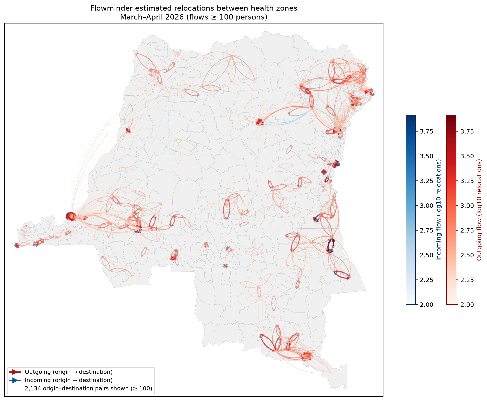

# Flowminder relocation estimates (HDX)

Phone-based internal relocation estimates between DRC health zones, derived from Vodacom CDR data and published by [Flowminder on HDX](https://data.humdata.org/dataset/democratic-republic-of-congo-population-and-relocation-estimates).



## Source

| Item | Location |
|------|----------|
| HDX dataset | [Democratic Republic of the Congo - Population and Relocation Estimates](https://data.humdata.org/dataset/democratic-republic-of-congo-population-and-relocation-estimates) |
| Raw OD table | `raw/hdx_flowminder_relocations_march2026.csv` |
| Column schema | `raw/hdx_flowminder_relocations_march2026_schema.csv` |

Each row is an origin–destination health-zone pair. Monthly relocation columns (`est_flows_YYYY_MM`) hold estimated persons relocating during that month; values below the disclosure threshold appear as `redacted (count <15)`.

## Processed output

| File | Description |
|------|-------------|
| `processed/flowminder__relocations__static.matrix.csv` | Square OD matrix of pairwise relocations for **2026-03 → 2026-04** (`est_flows_2026_04`) |
| `zone_resolution_log.csv` | HDX labels that could not be mapped to canonical shapefile `Nom` |

Matrix convention matches the rest of this repository: first column/header is `nom`; row = origin zone, column = destination zone; values are person counts.

## Workflow

```bash
# From repo root (BDBV2026-Data)
python data/flowminder/process.py
python data/flowminder/plot_relocations_map.py
.venv/bin/python -m tools.qa flowminder   # optional QA
```

### `process.py`

1. Read `raw/hdx_flowminder_relocations_march2026.csv`.
2. Keep rows with a positive value in `est_flows_2026_04` (skip blank and redacted cells).
3. Normalise HDX zone names (`kn Bunia Zone de Santé` → `Bunia`, etc.).
4. Resolve to canonical shapefile labels via `data/aliases.csv`, structural variants, and `LOCAL_FIXUPS` in `process.py`.
5. Aggregate duplicate origin–destination pairs and write the square matrix.

### `plot_relocations_map.py`

National map of all health zones (light grey fill) with relocation flows **≥ 100 persons** drawn as lines (viridis, log10 scale). Case counts are not shown.

## Coverage

The HDX export covers health zones nationally (26 provinces in the March 2026 release). Zones present in the raw file but absent from `DRC_Health_zones.shp` (e.g. `Haut Plateau`, `Kiambi`, `Citenge`) are logged and excluded.

## Related datasets

- **`data/flowminder_short_trips/`** — short-trip destination proportions for the Bunia/Mongbalu/Rwampara cohort (April–May 2026 PDF annex).
- **`data/IDP/`** — reported internal displacement matrices (different source and signal).

## Citation

Flowminder Foundation (2026). *Democratic Republic of the Congo - Population and Relocation Estimates.* Humanitarian Data Exchange. Contact: rdc@flowminder.org

See `metadata.yaml` for retrieval date and licence.
