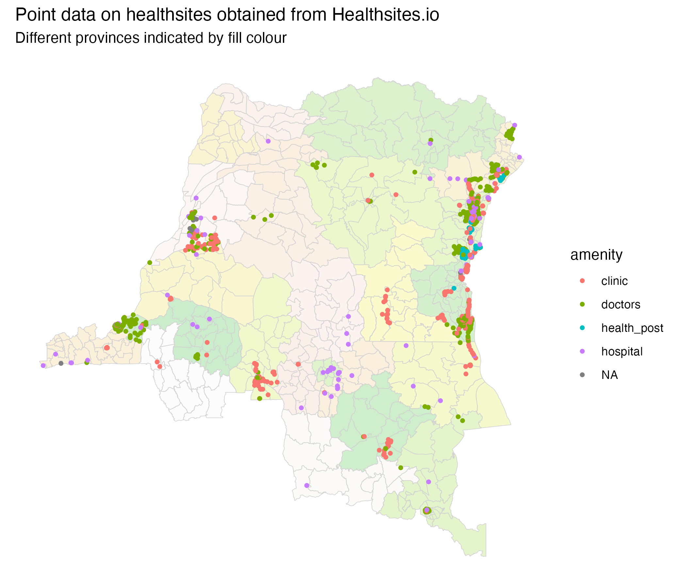
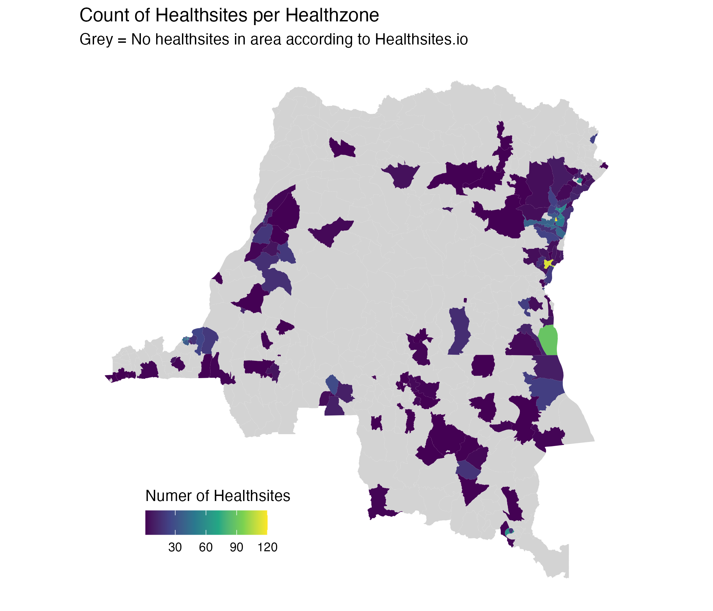
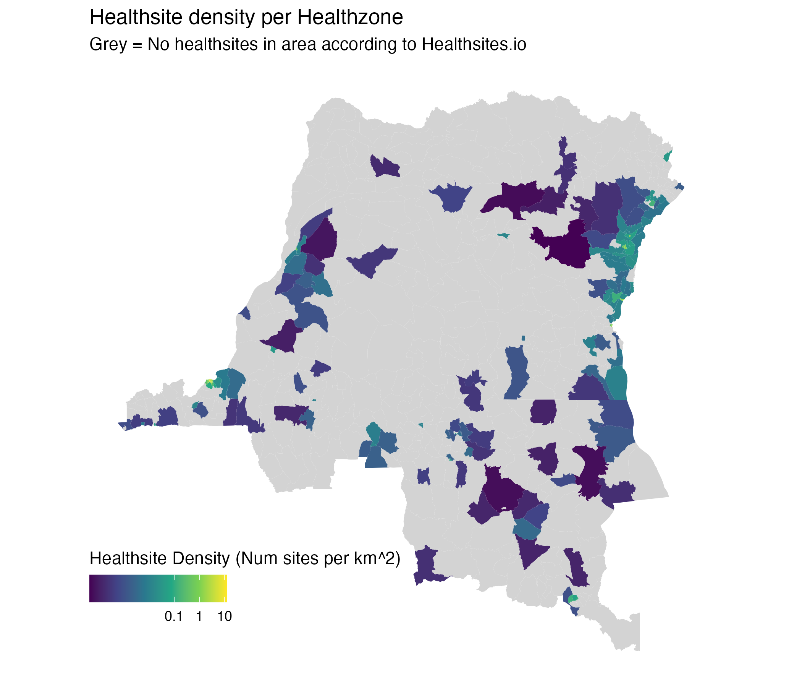

# Healthsites.io facility counts by health zone

Health-zone-level counts and **density** of mapped health facilities in the Democratic Republic of the Congo (DRC), derived from [Healthsites.io](https://healthsites.io/) OpenStreetMap extracts and aggregated to `data/shapefiles/DRC_Health_zones.shp`.

These data support outbreak analyses where facility availability, geographic gaps in the mapped network, or care-seeking distance proxies may matter. They reflect **crowdsourced OSM coverage**, not a complete Ministry of Health facility master list.



*Filtered Healthsites.io point locations over health-zone boundaries (province fill). Generated by `process.R`.*



*Number of facilities intersecting each health zone. Grey = zero sites in extract.*



*Facilities per km² (log₁₀ scale). Grey = zero sites in extract.*

------------------------------------------------------------------------

## About Healthsites.io

[Healthsites.io](https://healthsites.io/) maintains a global map of health-facility locations by curating and validating data from **OpenStreetMap (OSM)**. The project aims to provide accessible baseline facility data for humanitarian and public-health use. Facility attributes follow the [Healthsites data model](https://github.com/healthsites/healthsites/wiki/Healthsites-data-model) (OSM `amenity` / `healthcare` tags).

**Provenance (upstream extract):** see `raw/README.md` and `raw/LICENSE.txt`. Data are provided under the **Open Database License (ODbL)**; credit **© OpenStreetMap contributors** and [Healthsites.io](https://healthsites.io/) when using or publishing derivatives.

**Caveats:** The extract may lag live OSM; deleted or moved facilities can still appear. Healthsites.io provides data on a best-effort basis and does not guarantee completeness—especially in rural DRC where OSM mapping is uneven.

------------------------------------------------------------------------

## Files

| File | Description |
|----|----|
| `processed/healthsites_io__healthsite_count__static.csv` | Repo contract: `nom`, `healthsite_count` (519 rows) |
| `processed/healthsites_io__healthsite_density__static.csv` | Repo contract: `nom`, `healthsite_density` (sites per km²) |
| `raw/Democratic Republic of the Congo-node.shp` | Upstream Healthsites.io point extract (OSM nodes) |
| `raw/healthsites_raw_filtered.shp` | Points after amenity/healthcare filters (`process.R`) |
| `raw/included_amenities.txt` | Amenity types retained after filtering |
| `raw/included_healthcare.txt` | Healthcare types retained after filtering |
| `raw/README.md`, `raw/LICENSE.txt` | Upstream provenance and ODbL licence |
| `process.R` | Filter points, spatial join, plot, export CSVs |
| `metadata.yaml` | Provenance, licence, and pipeline notes |

**Coverage:** 519 health zones (national).\
**Temporal scope:** Static snapshot from the committed OSM extract (not a time series).

------------------------------------------------------------------------

## Method (this repo)

1.  **Load points** — `raw/Democratic Republic of the Congo-node.shp` (Healthsites.io / OSM).
2.  **Filter** — Exclude non-target facility types:
    -   `amenity`: drop `pharmacy`, `dentist`, `school`
    -   `healthcare`: drop `laboratory`, `rehabilitation`, `blood_donation`, `optometrist`\
        Retained categories are listed in `raw/included_amenities.txt` and `raw/included_healthcare.txt` (e.g. hospital, clinic, doctors, health_post).
3.  **Spatial join** — `st_intersects` between filtered points and health-zone polygons (`st_make_valid` on zones). Count = number of points intersecting each zone.
4.  **Disambiguate `nom`** — Where the same zone name appears in multiple provinces (**Bili**, **Lubunga**), `nom` is suffixed with province: e.g. `Bili (Nord-Ubangi)`, `Lubunga (Tshopo)` (matches the repo’s Python schema contract).
5.  **Density** — `healthsite_density = healthsite_count / area_km²` (zone area from `st_area`, converted to km²).
6.  **Export** — Tabular CSVs with `st_drop_geometry()`; choropleth and point maps saved as PNG.

**Units**

| Variable | Unit | Description |
|----|----|----|
| `healthsite_count` | count | Integer number of filtered points in the zone |
| `healthsite_density` | sites per km² | `healthsite_count` / zone area |

------------------------------------------------------------------------

## CSV contract

| Column | Description |
|----|----|
| `nom` | Health-zone name (province suffix where needed for duplicates) |
| `healthsite_count` | Count of filtered Healthsites.io points in the zone |
| `healthsite_density` | `healthsite_count` per km² of zone area |

`write.csv()` adds a leading `X` column (row index); ignore for analysis.

**Example (R):**

``` r
library(here)

hs <- read.csv(here("data/healthsites_io/processed/healthsites_io__healthsite_count__static.csv"))
hs[hs$healthsite_count > 10, c("nom", "healthsite_count")]
```

------------------------------------------------------------------------

## Regenerating outputs

From the **repository root**:

``` bash
Rscript data/healthsites_io/process.R
```

**R packages:** `sf`, `dplyr`, `here`, `ggplot2`.

Overwrites:

-   `raw/healthsites_raw_filtered.shp` (+ sidecar files)
-   `raw/included_amenities.txt`, `raw/included_healthcare.txt`
-   `processed/healthsites_io__healthsite_count__static.csv`
-   `processed/healthsites_io__healthsite_density__static.csv`
-   `raw_point_data_plot.png`, `healthsite_count_data_plot.png`, `healthsite_density_data_plot.png`

------------------------------------------------------------------------

## Data quality and limitations

| Issue | Detail |
|----|----|
| **OSM completeness** | 2,704 filtered points nationally; **342 of 519 zones** have zero sites in this extract—often under-mapping, not necessarily absence of facilities. |
| **Point-in-polygon** | `st_intersects` counts points inside or on zone boundaries; does not assign facilities by address or catchment. |
| **Filtering** | Pharmacies, dentists, schools, labs, and several other types are **excluded** by design—counts are not total health infrastructure. |
| **Duplicate names** | Resolved in export via `nom (PROVINCE)`; join to other tables on this `nom` or on `ZSCode` from the shapefile. |
| **Static extract** | Not synchronized with live OSM; refresh requires a new upstream Healthsites.io download. |

------------------------------------------------------------------------

## Provenance

-   **Facility locations:** [Healthsites.io](https://healthsites.io/) extract from [OpenStreetMap](https://www.openstreetmap.org/).
-   **Zone geometry:** `data/shapefiles/DRC_Health_zones.shp`.
-   **Metadata:** `metadata.yaml`.

For project-wide data conventions, see `data/README.md`.
